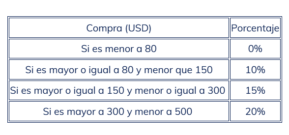

# Proyectos-python
Proyectos de aprendizaje
## primer proyecto
variables
instrucciones: crea una variable que a la hora de imprimirla imprima tu comida favorita
## segundo proyecto
funcion input
instrucciones: crea un programa pidiendole su edady calcula cuantos años tendra en 5 años
## tercer proyecto
if y else
instrucciones: Haz un programa que pregunte si hace frío y, dependiendo de la respuesta, recomiende llevar una chaqueta.
## operadores
en el curso me pidieron que haga un programa donde le pida dos numeros al usuario
y usted utilice esos numeros para hacer operaciones basicas
## programa de descuentos
Imagina que la tienda donde usted trabaja ofrece descuentos a los clientes en navidad, de acuerdo con el monto de su compra. El criterio para establecer el descuento se muestra a continuación:

Teniendo en cuenta la tabla, te piden que escribas un programa que solicite el nombre del cliente y el valor de la compra. Y que arroje como resultado: 

Nombre del cliente

Valor de la compra sin descuento

Valor de la compra con descuento.

 

Recuerde que para calcular el descuento primero debe multiplicar el valor de la compra por el porcentaje. Luego, debe restar el valor obtenido al valor de la compra y con eso obtiene el precio con descuento.

descuento = valor_compra x porcentaje

precio final = valor_compra - descuento
## promedio universitario
Imagina que culminaste el 5º semestre de la universidad, en el cual viste las siguientes asignaturas: Seguridad Informática, Ingeniería Web, Inteligencia Artificial, Programación Móvil y Redes; y las notas fueron las siguientes: 5.0, 4.5, 3.6, 3.9 y 4.3 respectivamente. 

 

Teniendo claro esto, escribe un programa que solicite tu nombre completo, el nombre de las cinco materias y la calificación de cada una. Y como resultado devuelve tu nombre y el promedio obtenido en el semestre.

 

Recuerda que la fórmula para calcular el promedio es: 

Promedio = (Nota1 + Nota2 + Nota3 + Nota4 + Nota5)/Cantidad de notas
## Ejercicio: Adivina el número
Escribe un programa en Python que genere un número aleatorio entre 1 y 100. Luego, el usuario debe adivinar el número, ingresando valores hasta acertar.

El programa debe dar pistas indicando si el número ingresado es mayor o menor que el número secreto. Cuando el usuario acierte, el programa debe mostrar un mensaje de felicitación y la cantidad de intentos utilizados.

## Ejercicio: Agenda telefónica
Las agendas telefónicas son una guía donde se encuentran los datos de diferentes personas como su nombre, domicilio y teléfono. Además, sirven para localizar personas, lugares o servicios. 

 

Dicho lo anterior, escribe un programa que permita guardar nombres y números de teléfono. El programa nos dará el siguiente menú:

(1) Consultar: pide un nombre. Si el nombre se encuentra en la agenda, debe mostrar el teléfono, si no indicar que no existe.

(2) Añadir: pide un nombre. Si el nombre se encuentra en la agenda, indicar que ya existe, si no solicitar el número de teléfono.

(3) Modificar: pide un nombre. Si el nombre no está en la agenda, indicar que no existe, sino solicitar el nuevo número de teléfono.

(4) Borrar: pide un nombre. Si el nombre no está en la agenda, indicar que no existe, sino eliminar el número de teléfono.

(5) Salir: si el usuario digita el número 5, detener el ciclo.

## ejercicios de variables
### Area de un triangulo
 Pide la base y la altura, y calcula el área.
 
### Conversor de Temperatura
Convierte de grados Celsius a Fahrenheit.

### Cálculo del IMC
Pide peso (kg) y altura (m), luego calcula el Índice de Masa Corporal.